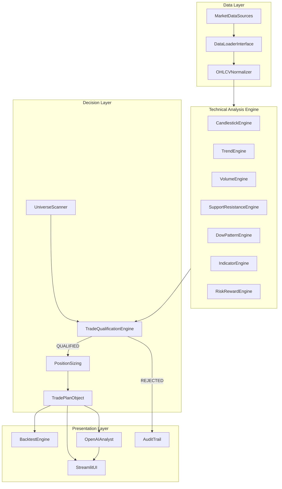
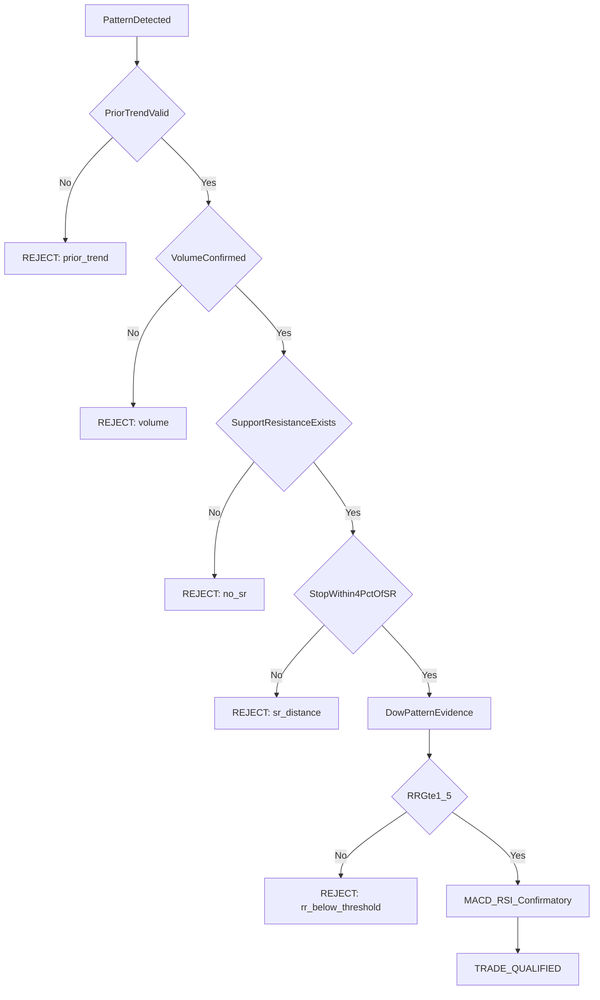

# Trading Analyst Agent (TAA) — Story-Level Execution Plan

## North Star

Build a **deterministic trading-analysis engine** with an **LLM analyst on top**. Python computes every trade decision; the LLM only explains pre-computed evidence.

**Core question the app answers:**

> Given today's EOD market data, are there any technically valid trades in my universe, and if so, what are the exact entry, stop-loss, target, position size, and expected holding period?

**Source of truth:** [TA.md](/Users/rparthas/git/DigitalBrain/0.Inbox/TA.md) — Zerodha Varsity Module 2 (Technical Analysis), especially Chapter 19 scanning checklist and Chapter 18 RRR rules.

**Workspace:** [`/Users/rparthas/git/Trading`](/Users/rparthas/git/Trading) — repo bootstrapped (M0 complete, M1 in progress).

---

## Guiding Principles

1. **Strategy validity ≠ empirical validity** — the engine can say "valid setup per methodology" without predicting price direction.
2. **NO TRADE is a first-class outcome** — most days should produce zero qualified trades (TA.md: 4–5 shortlisted → 0–2 qualify).
3. **Quantified rules only** — no `if candle looks bullish`; every pattern uses explicit ratios/tolerances.
4. **Gated qualification, not weighted scoring** — mandatory gates first, confirmatory indicators last.
5. **Backtest before live recommendations** — Milestone 5 is a hard gate.
6. **Data source is pluggable** — abstract `DataLoader` interface; pick Yahoo/NSE/Kite during implementation without rewriting strategy code.

---

## Architecture



**Signal priority (from TA.md Chapter 19):**

```text
Pattern → Prior Trend → Volume → S/R alignment → Dow structure → R:R ≥ 1.5 → MACD/RSI (confirmatory)
```

---

## Repository Bootstrap (Day 0)

**Goal:** Create empty repo with plan and project skeleton — no strategy code yet.

### Stories

| ID | Story | Acceptance Criteria |
|----|-------|---------------------|
| S0.1 | Initialize git repo | `git init -b main` in `/Users/rparthas/git/Trading`; `.gitignore` covers `.env`, `__pycache__`, `.venv`, `data/cache/` |
| S0.2 | Add project plan | `PLAN.md` (this document) committed as first artifact |
| S0.3 | Add README | One-page overview: purpose, architecture diagram, milestone roadmap, how to run (placeholder) |
| S0.4 | Scaffold directories | Empty package dirs per structure below; `pyproject.toml` + `uv.lock` for deps |
| S0.5 | Push to Cursor-hosted repo | Follow `new-repo` skill: `origin repo create trading-analyst`, push `main` |

### Target structure

```text
trading-analyst/
├── PLAN.md
├── README.md
├── app.py
├── config/
│   └── strategy.yaml          # Milestone 1 deliverable
├── data/
│   ├── loader.py              # Abstract DataLoader protocol
│   ├── normalizer.py
│   └── cache.py
├── patterns/
│   ├── single_candle.py
│   ├── multi_candle.py
│   ├── trend.py
│   ├── support_resistance.py
│   └── dow.py
├── indicators/
│   ├── moving_average.py
│   ├── rsi.py
│   ├── macd.py
│   └── bollinger.py
├── strategy/
│   ├── scanner.py
│   ├── qualification.py
│   ├── risk.py
│   ├── position_sizing.py
│   └── trade_plan.py
├── backtest/
│   ├── engine.py
│   ├── metrics.py
│   └── reports.py
├── llm/
│   ├── analyst.py             # OpenAI
│   └── prompts.py
├── models/
│   ├── market.py
│   └── trade.py
└── tests/
```

---

## Milestone 1 — Strategy Specification (The Contract)

**Epic:** Convert TA.md into machine-readable, testable rules.

### Key thresholds (from TA.md)

| Rule | Value | Source |
|------|-------|--------|
| Universe | NIFTY 50 | Ch. 19 |
| Timeframe | Daily EOD | Ch. 19 |
| Lookback | 6–12 months (2 years for S/R) | Ch. 19 |
| Volume confirmation | `volume >= 10-day avg` | Ch. 19 |
| S/R stop alignment | S/R within 4% of pattern stop | Ch. 19 |
| Minimum R:R | 1.5 | Ch. 18–19 |
| Prior trend | Bullish patterns need prior downtrend; bearish need prior uptrend (Marubozu exempt) | Ch. 5–8 |
| Indicators | MACD + RSI confirmatory; can scale position size | Ch. 18–19 |

### Stories

| ID | Story | Acceptance Criteria |
|----|-------|---------------------|
| S1.1 | Author `strategy.yaml` | All thresholds above configurable; pattern tolerances documented |
| S1.2 | Define pattern rule specs | Each of 15 candlestick patterns has explicit ratio definitions (body/shadow/range) |
| S1.3 | Define gate types | Each checklist item tagged `mandatory` or `confirmatory` |
| S1.4 | Define output schemas | `PatternResult`, `TradeAnalysis`, `RejectionReason`, `TradePlan` Pydantic/dataclass models in `models/` |
| S1.5 | Document Marubozu exception | Prior-trend gate bypassed; entry/stop rules explicit |

### `strategy.yaml` skeleton

```yaml
universe:
  type: nifty50
  symbols_source: config/nifty50.csv

timeframe:
  primary: 1d
  lookback_months: 12
  sr_lookback_months: 24

volume:
  average_period: 10
  minimum_ratio: 1.0

support_resistance:
  max_stop_distance_pct: 4.0

risk_reward:
  minimum: 1.5

risk:
  max_risk_per_trade_pct: 0.5
  max_position_pct: 10
  max_open_positions: 5

indicators:
  rsi: { period: 14 }
  macd: { fast: 12, slow: 26, signal: 9 }
  ma_periods: [20, 50, 100, 200]

patterns:
  marubozu:
    shadow_tolerance_pct: 0.2   # to be calibrated against TA.md examples
    min_body_ratio: 0.95
  hammer:
    lower_shadow_min_ratio: 2.0  # shadow:body per TA.md
```

---

## Milestone 2 — Market Data Layer

**Epic:** Reliable, normalized OHLCV for NIFTY 50 daily bars.

### Stories

| ID | Story | Acceptance Criteria |
|----|-------|---------------------|
| S2.1 | `DataLoader` protocol | `load_ohlcv(symbol, start, end) -> DataFrame` with columns `open, high, low, close, volume, date` |
| S2.2 | First adapter implementation | One working adapter (likely `yfinance` for MVP speed); swappable via config |
| S2.3 | NIFTY 50 symbol list | `config/nifty50.csv` with current constituents |
| S2.4 | Normalizer | Corporate-action-safe dtypes, sorted dates, missing-bar handling |
| S2.5 | Cache layer | Local parquet/SQLite cache to avoid re-fetching; `data_timestamp` tracked |
| S2.6 | Tests | Loader returns valid data for RELIANCE, TCS; handles weekends/holidays |

---

## Milestone 3 — Technical Analysis Engine

**Epic:** Deterministic, unit-tested analysis modules.

### Stories by module

**Candlesticks (S3.1–S3.3)**

| Pattern Group | Patterns |
|---------------|----------|
| Single | Marubozu (bull/bear), Doji, Spinning Top, Hammer, Hanging Man, Shooting Star |
| Multi | Engulfing (bull/bear), Harami (bull/bear), Piercing, Dark Cloud, Morning Star, Evening Star |

Each detector returns structured output:

```python
{
  "pattern": "bullish_hammer",
  "direction": "LONG",
  "strength": 0.82,
  "candle_index": -1,
  "entry_reference": 1455.0,
  "stop_reference": 1418.0,
  "validation": { "body_ratio": 0.18, "lower_shadow_ratio": 0.63 }
}
```

**Trend (S3.4):** `detect_prior_trend()`, `detect_primary_trend()`, `detect_secondary_trend()` via swing highs/lows + MA slope.

**Volume (S3.5):** 10-day average ratio; tier labels (1.0x acceptable, 1.25x strong, etc.) as metadata only.

**S/R (S3.6):** Zone-based output (not single magic number); swing highs/lows, reaction zones; 4% stop-distance check.

**Dow (S3.7):** Double/triple top/bottom, flags, range breakouts — evidence objects, not confidence scores.

**Indicators (S3.8):** SMA/EMA (20/50/100/200), RSI(14), MACD(12,26,9). Bollinger Bands stubbed for V2.

**Tests (S3.9):** Fixture candles per pattern; golden-file tests against known TA.md chart examples.

---

## Milestone 4 — Trade Qualification Engine

**Epic:** `analyze_stock()` and `scan_universe()` with full rejection audit trail.

### Qualification gate flow



### Stories

| ID | Story | Acceptance Criteria |
|----|-------|---------------------|
| S4.1 | `analyze_stock(symbol, date)` | Returns `TradeAnalysis` with per-gate pass/fail + rejection reasons |
| S4.2 | `scan_universe(date)` | Scans all NIFTY 50; returns `{qualified: [], rejected: [], no_pattern: []}` |
| S4.3 | R:R engine | Entry/stop from pattern; target from nearest S/R; `rr = reward/risk` |
| S4.4 | Position sizing | `shares = (account * risk_pct) / (entry - stop)`; indicator confirmation scales size |
| S4.5 | Trade plan object | Entry, stop, target, R:R, shares, holding period (3–10 days), direction |
| S4.6 | Audit record | Every scan writes timestamped JSON/parquet with `strategy_version`, `data_timestamp`, all gate results |
| S4.7 | CLI smoke test | `python -m strategy.scanner --date 2026-09-19` prints daily scan report |

### Example output (target UX)

```text
DAILY TRADE SCAN — NIFTY 50 — 19 Sep 2026
Candidates: 4 | Qualified: 1

RELIANCE  LONG  [TRADE]
  Pattern: Bullish Hammer | Prior trend: Downtrend
  Volume: 1.42x | S/R: aligned | R:R: 1.76
  Entry: 1455 | Stop: 1418 | Target: 1520 | Size: 135 shares

REJECTED:
  TCS       → R:R 1.18
  INFY      → volume insufficient (0.74x)
  HDFCBANK  → no recognizable pattern
```

---

## Milestone 5 — Backtesting (Validation Gate)

**Epic:** Prove (or disprove) methodology expectancy before any live recommendations.

**This milestone blocks Milestones 6–7.**

### Stories

| ID | Story | Acceptance Criteria |
|----|-------|---------------------|
| S5.1 | Backtest engine | Walk-forward daily scan over historical period (2018–2026 target) |
| S5.2 | Trade simulation | Enter at next-day open (configurable); exit at stop, target, or max holding period |
| S5.3 | Core metrics | Win rate, avg win/loss, expectancy, profit factor, max drawdown, Sharpe, avg holding days |
| S5.4 | Strategy breakdowns | Performance by pattern, R:R bucket, volume tier, with/without MACD/RSI |
| S5.5 | Report output | `python backtest/run.py` → console summary + equity curve PNG + CSV trade log |
| S5.6 | Out-of-sample split | Train rules on 2018–2023, validate 2024–2026; no parameter optimization in V1 |

### Go/no-go criteria (suggested)

- Engine runs end-to-end without errors on full NIFTY 50 history
- Rejection reasons are auditable and sum to 100% of decisions
- Results are directionally sensible (not 90% win rate — that signals overfitting)
- Team reviews pattern-level expectancy before proceeding

---

## Milestone 6 — Streamlit UI

**Epic:** Presentation layer over the working engine — no business logic in UI.

### Screens

| Screen | Purpose |
|--------|---------|
| Dashboard | Market status, today's qualified trades, rejected summary |
| Stock Analysis | Single-symbol deep dive: chart, pattern, gates, trade plan |
| Scanner | Sortable table: Pattern, Trend, Volume, S/R, R:R, Indicators, Decision |
| Backtest | Equity curve, monthly returns, pattern performance |
| Trade Journal | Manual log of taken trades + outcomes (V1: local storage) |

### Stories

| ID | Story | Acceptance Criteria |
|----|-------|---------------------|
| S6.1 | `app.py` multi-page Streamlit shell | 5 pages wired; shared config from `strategy.yaml` |
| S6.2 | Scanner page | Runs `scan_universe()` for selected date; color-coded TRADE/REJECT |
| S6.3 | Stock analysis page | Candlestick chart (plotly/mplfinance); gate checklist with checkmarks |
| S6.4 | Backtest page | Upload or select cached backtest results; render metrics + charts |
| S6.5 | Rejection drill-down | Click rejected row → see per-gate failure reasons |

---

## Milestone 7 — OpenAI Analyst Layer

**Epic:** Human-readable explanations that cannot alter numbers.

### Stories

| ID | Story | Acceptance Criteria |
|----|-------|---------------------|
| S7.1 | `llm/analyst.py` | Accepts `TradePlan` JSON; returns structured explanation |
| S7.2 | Prompt templates | Sections: thesis, evidence, risks, invalidation, summary |
| S7.3 | Guardrails | LLM output validated: no numeric fields differ from input; retry on violation |
| S7.4 | NO TRADE narrative | LLM explains why zero trades today using rejection aggregate |
| S7.5 | Streamlit integration | "Explain" button on qualified trades; explanation cached in audit log |

### LLM input contract (immutable fields)

```json
{
  "symbol": "RELIANCE",
  "direction": "LONG",
  "pattern": "bullish_hammer",
  "prior_trend": "downtrend",
  "volume_ratio": 1.42,
  "support": 1420,
  "entry": 1455,
  "stop": 1418,
  "target": 1520,
  "rr": 1.76,
  "macd": "bullish",
  "rsi": 54
}
```

---

## V1 Scope Boundaries

### In scope

- NIFTY 50, daily EOD, 15 candlestick patterns
- Trend, volume, S/R, Dow, R:R, position sizing
- LONG / SHORT / NO TRADE
- Backtesting (mandatory gate)
- Streamlit UI
- OpenAI explanation layer

### Explicitly out of scope (V2+)

- Intraday / scalping (different R:R rules per TA.md Ch. 19.5)
- Options, futures, order execution
- News sentiment, fundamentals, ML prediction
- Parameter optimization / curve fitting
- NIFTY 100/200 expansion (after V1 validated)

---

## Suggested Sprint Sequence

| Sprint | Milestone | Duration (est.) | Deliverable |
|--------|-----------|-----------------|-------------|
| 0 | Repo bootstrap | 1 day | Empty repo + PLAN.md + skeleton |
| 1 | M1 Strategy spec | 3–5 days | `strategy.yaml` + models + pattern specs |
| 2 | M2 Data layer | 3–5 days | `load_ohlcv()` + cache + tests |
| 3–4 | M3 TA engine | 2–3 weeks | All pattern/trend/S/R/volume/indicator modules + tests |
| 5 | M4 Qualification | 1–2 weeks | `scan_universe()` + audit trail + CLI |
| 6 | M5 Backtest | 1–2 weeks | Historical validation + reports |
| 7 | M6 Streamlit | 1 week | 5-screen UI |
| 8 | M7 LLM analyst | 3–5 days | OpenAI explanations |

**Total estimate:** 8–10 weeks for a single developer, assuming part-time effort stretches longer.

---

## Risk Register

| Risk | Mitigation |
|------|------------|
| Pattern rules too vague | Every rule has numeric tolerance + unit test fixture |
| Data quality (splits, holidays) | Normalizer + manual spot-check against known charts |
| Overfitting during backtest | V1 uses fixed rules; out-of-sample split; no parameter sweeps |
| LLM hallucinating prices | Schema validation; numbers only from engine |
| NSE data access fragility | `DataLoader` abstraction; cache aggressively |

---

## Definition of Done (Project)

1. Evening workflow works: fetch EOD → scan NIFTY 50 → output 0–N trade plans with rejection audit
2. Backtest runs on 2018–2026 with full metrics report
3. Streamlit shows dashboard, scanner, stock analysis, backtest, journal
4. OpenAI explains qualified trades without altering numbers
5. "NO TRADE TODAY" renders cleanly with aggregate rejection reasons
6. All gates traceable to TA.md chapter references in `strategy.yaml` comments
